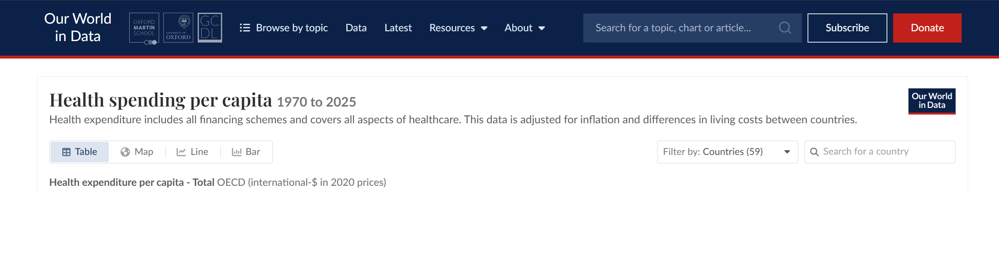
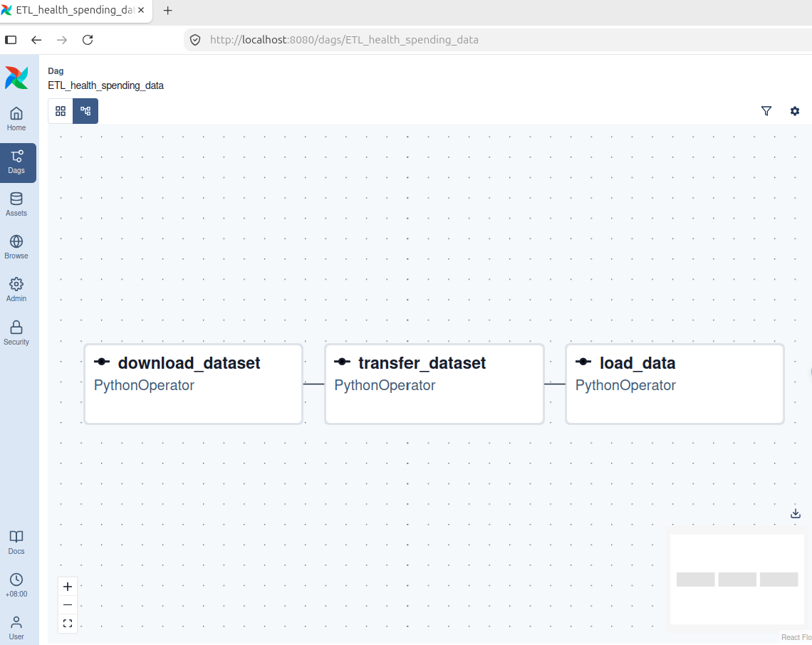
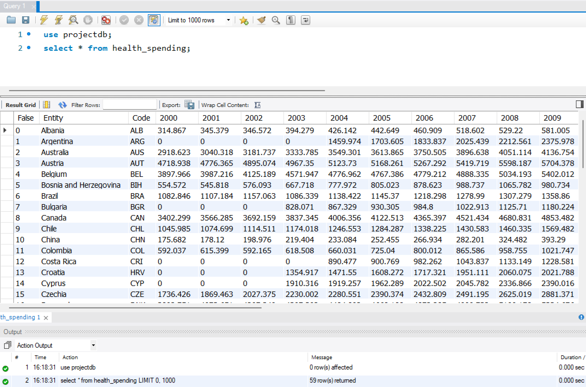

# health_spending
A side project that practices building an ETL data pipeline called health_spending.

# Source data from Our World in Data

### Health expenditure per capita - Total – OECD
Health expenditure in total divided by population.
Last updated: August 27, 2026  
Next expected update: August 2027  
Date range: 1970–2025  
Unit: international-$ in 2020 prices  
Source: OECD (2026) – with minor processing by Our World in Data  

# ETL_workflow

# Loading result

